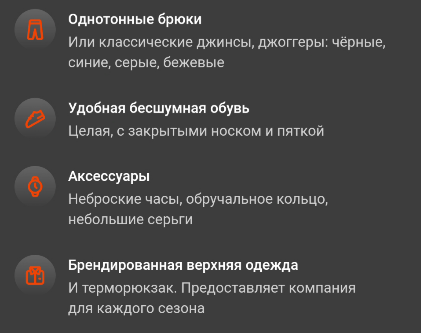

# Приступим

---

Делаю сайт-справочник для курьеров Сбермаркета.

{==

Здесь будет информация для тех, кто только прошёл инструктаж и ещё волнуется перед первым слотом.

==}

---

## Быстрый старт

В целом, вся деятельность сводится к следующему:

* Получили заказ.
* Пришли в магазин/ресторан/etc, отметили своё появление в приложении.
* Получили заказ, сложили его в сумку, вышли из здания и отметили, что заказ у вас, после этого в приложении отобразится адрес доставки.
* Пришли по адресу, отметили в приложении своё прибытие, получили до 10 минут на передачу заказа.
* Передали заказ, вышли из здания – отметили в приложении, что заказ передан.

## Перед сменой

* Телефон должен быть заряжен и настоятельно рекомендуется иметь PowerBank, чтобы не попадать в неприятные ситуации. Если слот на 5-6 часов, лучше гарантировать себе независимость от розетки на 8-10 часов – расход энергии во время работы может быть непривычно больше, чем при обычном использовании.

* 

В начале смены необходимо быть опрятным, бренд компании на форменной одежде должен быть виден. Наличие рюкзака не отменяет необходимость ношения формы. В целом, внешний вид должен с любого ракурса сообщать о том, что вы курьер Сбермаркета. { width="auto" align=right loading=lazy }

  

## Начало смены

---
## TODO

!!! attention "Первостепенная задача"
    
    + Здесь нужно наполнить полезным текстом типа уроков из Skill Cup, Шоппера или полезных постов из Telegram.
    + Добавить стандарты фотоконтроля в начале смены.